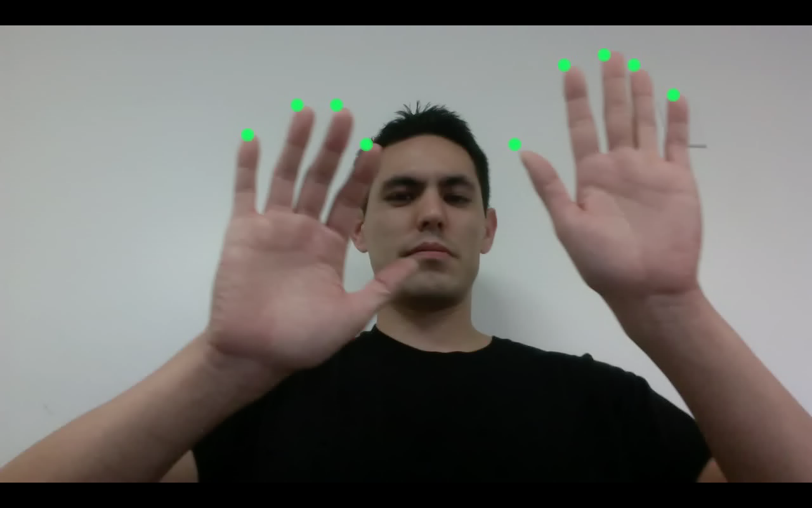
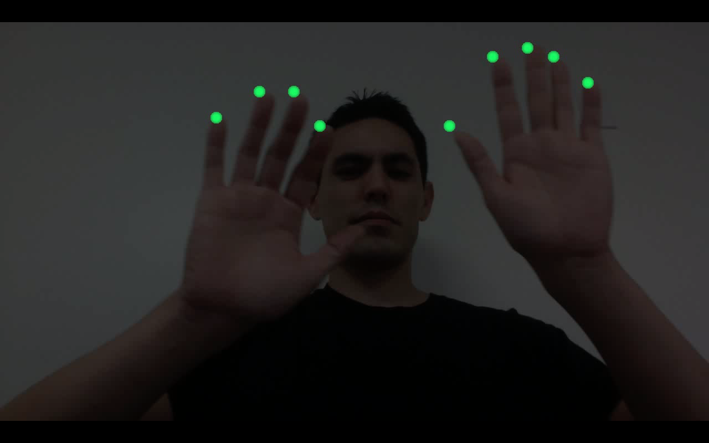
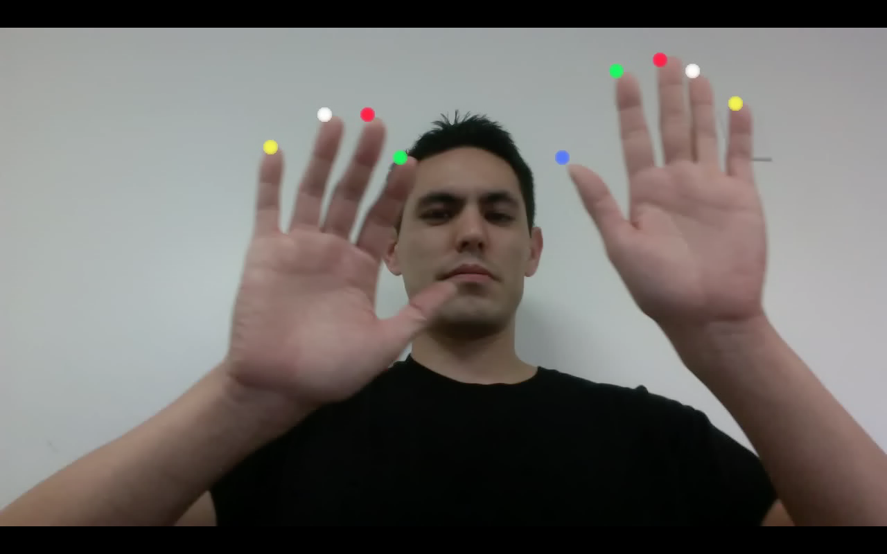
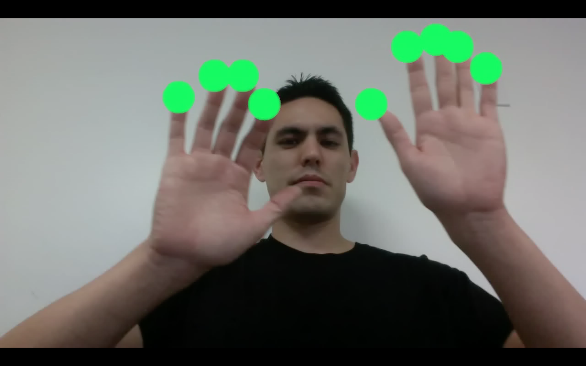
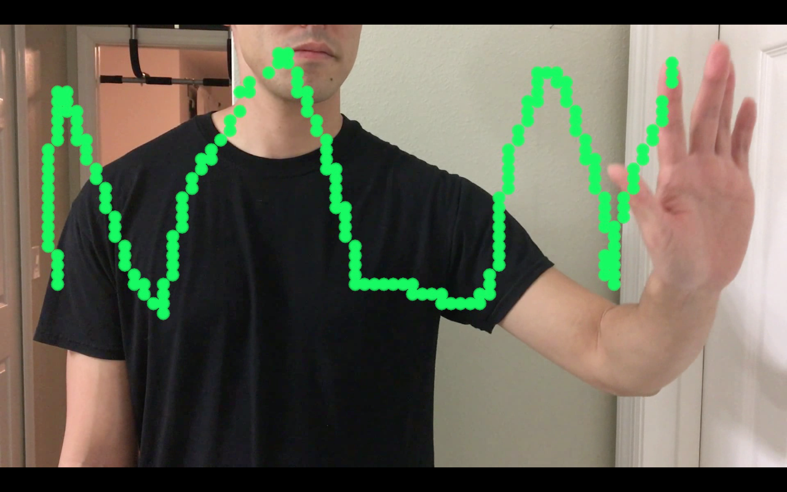
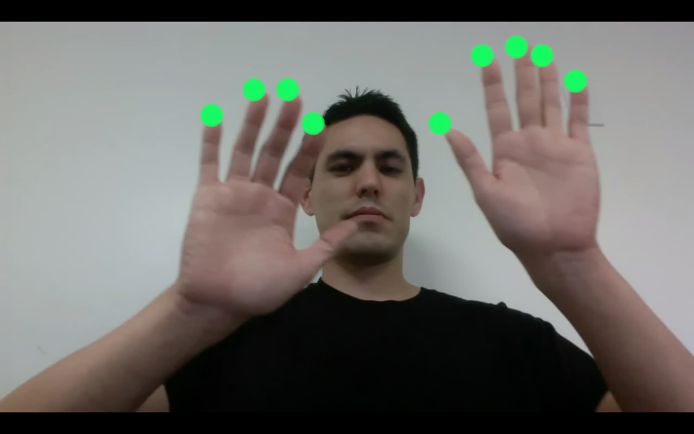
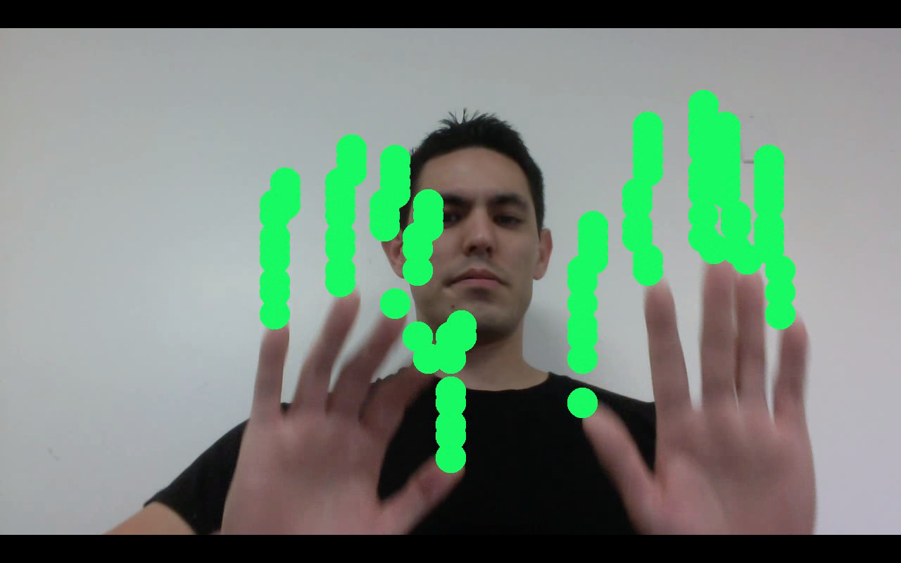
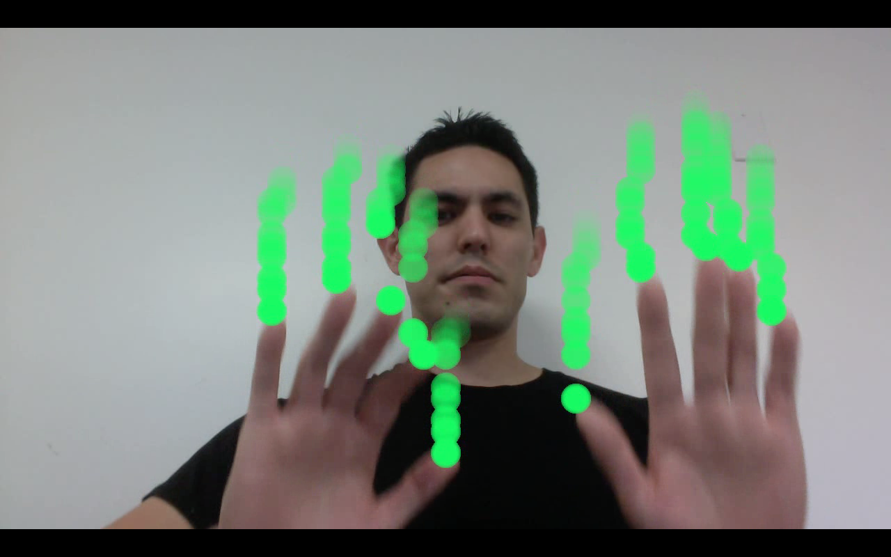

# Hand Lights

Augmented reality application that creates artificial lights on the finger tips of hands. The effect resembles a [gloving](https://en.wikipedia.org/wiki/Gloving) performance, which involves a person wearing gloves with LED lights on the tips. Hand keypoint detection is the core component of this project.

NOTE: Currently, the code only supports the use of a CPU, which takes takes about 10 seconds to process each frame. In a future release, I plan to add GPU support which should allow the application to run in real time.

## Demos

<a href="https://www.youtube.com/watch?v=5YvXUYoM7LY" target="_blank" style="padding: 5px">
    
</a>

<a href="https://www.youtube.com/watch?v=7l4pw9JNGGs" target="_blank" style="padding: 5px">
    
</a>

<a href="https://www.youtube.com/watch?v=ZK-QNONxQD4" target="_blank" style="padding: 5px">
    
</a>

Original Video: [Void Dreamers - Gloving Vietnam](https://www.youtube.com/watch?v=l5YnHunxVf4)

## Technical Specs

Python 3.6.3 <br/>
OpenCV-python 3.4.1.15 <br/>
NumPy 1.14.2 <br/>

## Getting Started

If you prefer to gain some background knowledge on hand keypoint detection before diving into the code of this project, I would highly recommend reading Vikas Gupta's [tutorial](https://www.learnopencv.com/hand-keypoint-detection-using-deep-learning-and-opencv/).

Since we are not using the GPU, the setup is very minimal for this project. 

1. Install or update Python, OpenCV, and NumPy. 
2. Cloan or download this project.
3. Download OpenPose's hand keypoint detection model (pose_iter_102000.caffemodel) and place it into the `hand_lights/caffe_model` folder. It can be downloaded from this repo's [release](https://github.com/michaelnation26/hand_lights/releases) or by running OpenPose's [getModels](https://github.com/CMU-Perceptual-Computing-Lab/openpose/blob/master/models/getModels.sh) script.

The following examples will demonstrate several ways to run the python program. Set the verbose flag to True if you would like to see the progress.

### Example \#1 - All default parameter values

```
python hand_lights.py \
--input_video_path media/videos/vertical.mp4 \
--output_video_path media/videos/vertical_output.mp4
```

<p align="center">
    
</p>

### Example \#2 - Darken background

```
python hand_lights.py \
--input_video_path media/videos/vertical.mp4 \
--output_video_path media/videos/vertical_output.mp4 \
--background_alpha 0.3
```

<p align="center">
    
</p>

### Example \#3 - Single color

```
python hand_lights.py \
--input_video_path media/videos/vertical.mp4 \
--output_video_path media/videos/vertical_output.mp4 \
--light_color red
```

<p align="center">
    
</p>

### Example \#4 - All colors

```
python hand_lights.py \
--input_video_path media/videos/vertical.mp4 \
--output_video_path media/videos/vertical_output.mp4 \
--light_color all
```

<p align="center">
    
</p>

### Example \#5 - Light size

```
python hand_lights.py \
--input_video_path media/videos/vertical.mp4 \
--output_video_path media/videos/vertical_output.mp4 \
--light_radius_frame_height_ratio 0.05
```

<p align="center">
    
</p>

### Example \#6 - Draw text

```
python hand_lights.py \
--input_video_path media/videos/draw_initials.mp4 \
--output_video_path media/videos/draw_initials_output.mp4 \
--fingers index \
--max_hands_detected 1 \
--light_duration_n_secs 12 \
--light_same_alpha True \
--mirror True
```

<p align="center">
    
</p>

## How It Works

### Detecting Finger Tips

The hand keypoint detection model from [OpenPose](https://github.com/CMU-Perceptual-Computing-Lab/openpose) is used to detect the finger tips of each hand on each frame.

<p align="center">
    
</p>

### Save Detections

The locations of the finger tips that are detected in each frame will be added to a circular queue. The queue will keep track of the detections from the past n number of frames. On every new frame, the entire queue will be used to draw the lights.

<p align="center">
    
</p>

### Fade Older Lights

The most recent finger tips will have fully opaque lights. As the lights become older, they will become more transparent.

<p align="center">
    
</p>

### Smooth Overlapping Edges

A Gaussian Blur is used to smoothen out the overlapping edges between light circles.

<p align="center">
    
</p>

### Python Script

To recreate the last example, use the following script.

```
python hand_lights.py \
--input_video_path media/videos/vertical.mp4 \
--output_video_path media/videos/vertical_output.mp4 \
--light_duration_n_secs 0.5 \
--light_radius_frame_height_ratio 0.03
```